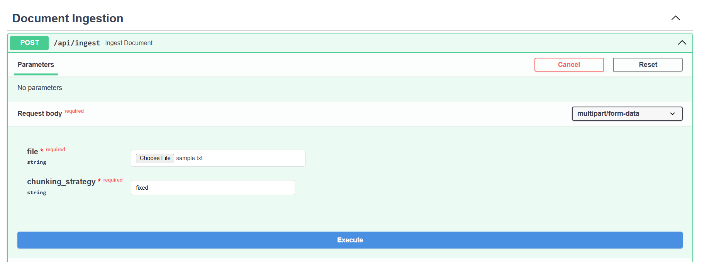
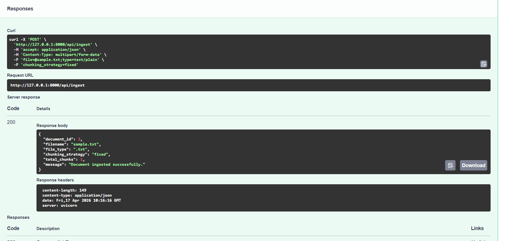

# AI/ML Intern Task

## Candidate
**Name:** Roshan Shrestha  

---

## Task Summary

This project implements a backend system with two core REST APIs:

1. **Document Ingestion API**
2. **Conversational RAG API**

The system supports document processing, semantic search, multi-turn conversation, and interview booking.

---

## System Architecture

The system follows a modular architecture:

- API Layer → FastAPI endpoints  
- Service Layer → Business logic (RAG, embeddings, booking)  
- Data Layer → SQLite + Qdrant  
- Memory Layer → Redis  

---

## 🔹 1. Document Ingestion API

### Endpoint
`POST /api/ingest`

### Features
- Upload `.txt` and `.pdf` files
- Extract text from files
- Apply **two chunking strategies**:
  - Fixed chunking
  - Paragraph chunking
- Generate embeddings using Sentence Transformers
- Store embeddings in **Qdrant vector database**
- Store document metadata in SQLite

---

## 🔹 2. Conversational RAG API

### Endpoint
`POST /api/chat`

### Features
- Custom RAG implementation (**no RetrievalQAChain used**)
- Retrieve relevant chunks from Qdrant
- Generate response using LLM (Ollama)
- Context-aware answers based on documents

---

## Multi-turn Chat Support

- Chat memory implemented using **Redis**
- Maintains conversation history per session
- Supports follow-up questions

---

## Interview Booking Feature

The system supports booking detection using LLM:

### Example Input

```bash
I want to book an interview. Name: Roshan, Email: roshan@example.com, Date: 2026-04-20, Time: 14:00
```


### Functionality
- Extracts structured data
- Stores booking in database
- Returns confirmation message

---

## Additional APIs

### GET `/api/documents`
- Returns all ingested documents

### GET `/api/bookings`
- Returns all interview bookings

---

## Technologies Used

- FastAPI
- Qdrant (Vector DB)
- Redis (Chat Memory)
- SQLite (Metadata Storage)
- Sentence Transformers (Embeddings)
- Ollama (LLM)

---

## How to Run

### 1. Install dependencies
```bash
pip install -r requirements.txt
```

### 2. Start services

#### Qdrant

```bash
docker run -p 6333:6333 qdrant/qdrant
```

#### Redis

```bash
docker run -p 6379:6379 redis
```

#### Ollama

```bash
ollama run llama3
```

### 3. Run Backend

```bash
uvicorn app.main:app --reload
```

### 4. API Documentation

Open in browser:

```
http://127.0.0.1:8000/docs
```

---

## Constraints Followed

- No FAISS / Chroma used  
- No RetrievalQAChain used  
- Custom RAG pipeline implemented  
- Redis used for chat memory

## Screenshots

### Document Ingestion


### Document Ingestion Response


### Booking System

